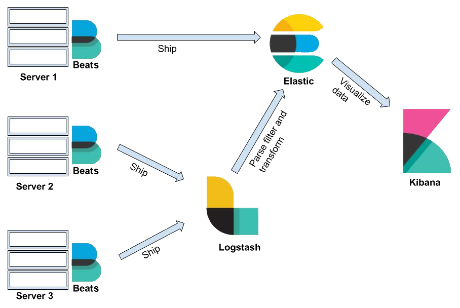

## 1. What is ELK?

- https://www.elastic.co/what-is/elk-stack

### Overview

- Elasticsearch is the heart of the free and open Elastic Stack
- Discover, iterate, and resolve with ES|QL on Kibana

### ELK Architecture

### Official website documentation of ELK

- https://www.elastic.co/guide/index.html

## 2. Prerequisites

- N/A

## 3. Installation

### How to install ELK?

- Installing the Elastic Stack: https://www.elastic.co/guide/en/elastic-stack/current/installing-elastic-stack.html

## 4. Basics of ELK

### Getting started with ELK

- Refer to the [Official ELK getting started documentation](https://www.elastic.co/guide/en/elasticsearch/reference/current/getting-started.html) for a comprehensive introduction.

### ELK Hello World

- Check the [helloworld/](./basic/helloworld/) directory to create a simple ELK demo.

## 5. Beyond the Basics

### Hands-On Example

- Explore a practical hands-on example in the [ELK hands-on](https://www.elastic.co/guide/en/elasticsearch/reference/current/index.html) for more ELK concepts

## 6. More

### ELK learning resource

- N/A

### Recommended Books

- N/A
