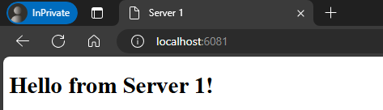

# HA proxy basics demo

## 1. Labs stack

- [nginx-webserver1](https://nginx.org/): An Ubuntu VM running in nginx webserver.
- [nginx-webserver2](https://nginx.org/): An Ubuntu VM running in nginx webserver.
- [haproxy](https://www.haproxy.org/): HA proxy points to 2 these web servers.

## 2. Setup

### Prerequisites

- Docker + Docker Compose

### Build and run the containers

- Option-1: Build and run in background (Recommend)

```bash
cd devops-basics/topics/haproxy/basic/
docker-compose up --build -d

# To stop and remove contaienr, run:
docker compose down
```

- Option-2: Run and verbose the logs

```bash
cd devops-basics/topics/haproxy/basic/
docker-compose up --build

# To stop, press 'Ctrl + C'
```

## 3. Explore the HA proxy

- Access the HA Proxy at http://localhost:6081 (You can replace 6081 by the port work on your machine!)
- Refresh the page multiple time and you would see that the HA Proxy route to `nginx-webserver1` and `nginx-webserver2` in Round Robin mode.

  
  

- Now try to stop the `nginx-webserver1` and refresh the page http://localhost:6081, it will check and only route to `nginx-webserver2`

  ```bash
  docker stop nginx-webserver1
  ```

  
  
