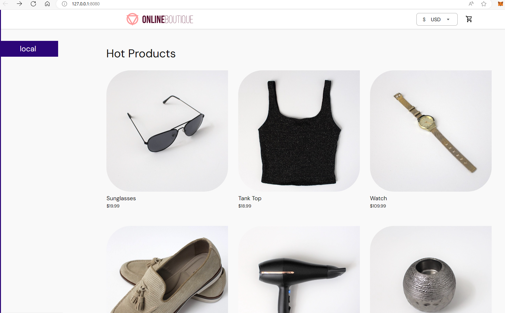

# Demo microservices

- Using GCP demo: https://github.com/GoogleCloudPlatform/microservices-demo
- Manifest: https://github.com/GoogleCloudPlatform/microservices-demo/blob/main/release/kubernetes-manifests.yaml

## 1. Provision K8s cluster

- Find the installation via [k8s](../../k8s/) content

## 2. Run hello microservices script

Prerequisite:

- A k8s cluster up and running (step 1)

Run:

```bash
./hello-microservices.sh
```

This will deploy the application then forward the service to port `8080` (or you could adjust to another port works with you machine)

## 3. Check the result

Visit localhost:8080, you should get the similar result like this:



## 4. Cleanup

Run:

```bash
./cleanup-hello-microservices.sh
```
