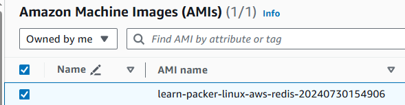

# Build an Ubuntu machine image on AWS with Packer

## Prerequisites

- AWS account
- Packer installed
- Authenticate to AWS
  ```bash
  export AWS_ACCESS_KEY_ID="<YOUR_AWS_ACCESS_KEY_ID>"
  export AWS_SECRET_ACCESS_KEY="<YOUR_AWS_SECRET_ACCESS_KEY>"
  ```
- Doc: https://developer.hashicorp.com/packer/integrations/hashicorp/amazon#iam-task-or-instance-role

## Init

```bash
packer init .
```

## Build

```bash
packer build aws-ubuntu.pkr.hcl

# ...
# ==> Wait completed after 5 minutes 15 seconds
# ==> Builds finished. The artifacts of successful builds are:
# --> learn-packer.amazon-ebs.ubuntu: AMIs were created:
# us-west-2: ami-xxxxyyyyzzzztttt
```

## Verify

- Go to AWS Console `us-west-2` (The region we build packer AMI): https://us-west-2.console.aws.amazon.com/ec2/home?region=us-west-2#Images:visibility=owned-by-me
- You now can see your AMI with name: `learn-packer-linux-aws-redis-<timestamp>`
  

## Cleanup

- Once you dont want to use the AMI anymore, follow https://docs.aws.amazon.com/AWSEC2/latest/UserGuide/deregister-ami.html to delete it.
